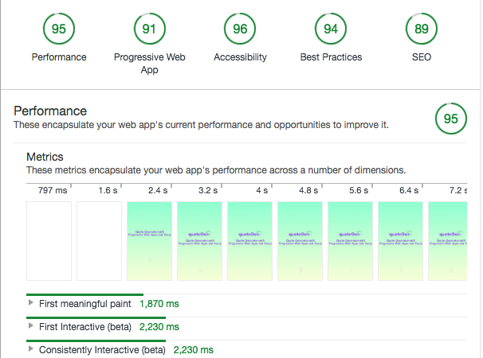

# Progressive Web Apps with Vue.js - Quote Generator
### Simple Quote Font Converter

---
- [x] Works offline (Add to your homescreen and then open the app, after that turn off your connection), 

- [x] web manifest (Have native like assets)

- [x] works like native apps (no zooming, no browser tab bar, no pulldown refresh).

> live on https://dist-ueggjtuofq.now.sh/

Production file is generated by "npm run build" from vue CLI 3 and placed in dist folder.

This is simple Quote bin is for you to store 10 quotes. Sorry if this is too simple :D I gotta keep learning to extend my knowledge on web development world.

---

### PWA Score : 91

